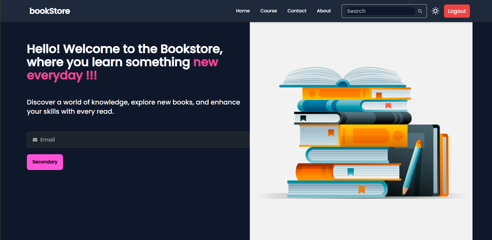
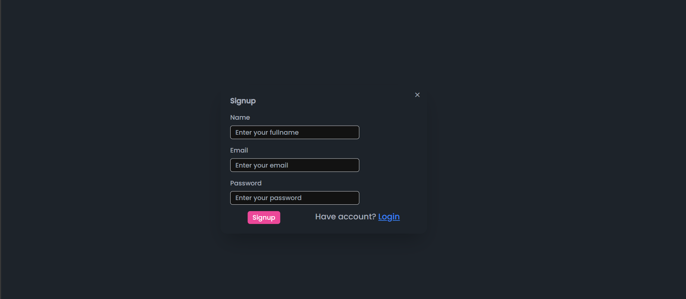
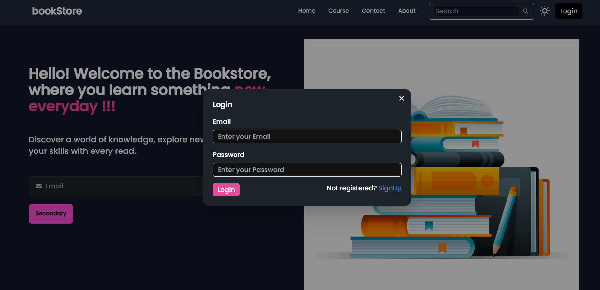
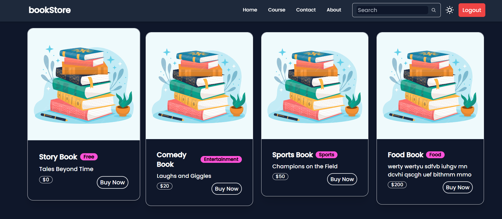

# E-bookstore

An online platform where users can explore ebooks and educational content. This project is designed to provide a seamless browsing experience for book lovers with features like user authentication, a responsive UI, and a collection of free and premium courses.

## Table of Contents
- [Description](#description)
- [Features](#features)
- [Tech Stack](#tech-stack)
- [Screenshots](#screenshots)
- [Installation](#installation)
- [Usage](#usage)
- [Contributing](#contributing)

## Description

E-bookstore is a fully responsive web application built using React, Tailwind CSS, and Node.js. It allows users to browse a wide selection of books and courses. Some features include user authentication, light/dark theme support, and a clean, modern design.

## Features

- **User Authentication:** Users can sign up, log in, and access protected resources.
- **Dark/Light Theme:** Switch between themes based on user preferences saved in local storage.
- **Course Access:** Registered users can access a list of available courses.
- **Responsive Design:** Works seamlessly on both desktop and mobile devices.
- **Real-time Notifications:** Toast notifications to improve user experience.
- **Carousel:** Display books and courses in a slick, interactive carousel.

## Tech Stack

### Frontend:
- **React**: For building the user interface.
- **Tailwind CSS**: For modern and responsive styling.
- **React Router**: For client-side routing.
- **Axios**: For handling API requests.
- **React Hook Form**: For form management.
- **Daisy UI**: For pre-built UI components.
- **React Slick & Slick Carousel**: For carousels and sliders.
- **React Hot Toast**: For displaying toast notifications.

### Backend:
- **Node.js**: JavaScript runtime environment.
- **Express**: Web framework for building RESTful APIs.
- **MongoDB & Mongoose**: NoSQL database and ORM.
- **bcrypt.js**: For password hashing.
- **dotenv**: For environment variable management.
- **Nodemon**: For development server auto-restarting.
- **CORS**: Middleware to enable cross-origin resource sharing.

## Screenshots

Here are some screenshots of the E-bookstore project:

### Homepage


### Sign Up


### Login


### Courses


### Contact


## Installation

Follow these steps to install and run the project locally:

1. Clone the repository:

    ```bash
    git clone https://github.com/inevitable-ank/e-bookstore.git
    ```

2. Navigate to the project directory:

    ```bash
    cd e-bookstore
    ```

3. Install frontend dependencies:

    ```bash
    npm install
    ```

4. Start the frontend development server:

    ```bash
    npm run dev
    ```

### Backend Setup:

1. Navigate to the `backend` folder:

    ```bash
    cd backend
    ```

2. Install backend dependencies:

    ```bash
    npm install
    ```

3. Start the backend server:

    ```bash
    npm start
    ```

Make sure you have MongoDB running locally or use a cloud-based MongoDB service (e.g., MongoDB Atlas). Also, create a `.env` file for environment variables like your database URI.

## Usage

- After setting up the frontend and backend, open your browser and navigate to `http://localhost:3000`.
- Sign up for a new account or log in with an existing account to access protected routes like the list of courses.

## Contributing

Contributions are welcome! Please follow these steps to contribute:

1. Fork the repository.
2. Create a new branch (`git checkout -b feature-branch`).
3. Make your changes and commit them (`git commit -m 'Add some feature'`).
4. Push the changes to your branch (`git push origin feature-branch`).
5. Open a Pull Request.

